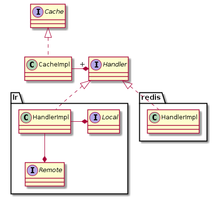

# 缓存
随着内存成本的不断降低，通过内存计算、缓存计算结果来加快响应速度已经成为一个比较成熟的设计方案，也是性能优化的一个重要手段。

## 以空间换时间
所谓“空间换时间”，是指通过内存来降低CPU时间，从而达到加快业务处理速度的目的。缓存的数据需要满足读频率远大于写频率这一前提。

## 保护数据库
数据库是整个应用服务的核心，也是稳定运行之基础，因此要尽可能地保护数据库，对于一些复杂的关联查询尽可能由程序实现以减少数据库压力。而对于一些使用频率很高的数据，也尽可能通过程序缓存来实现。

通过程序来实现数据计算，因为是针对业务的特定算法，因此其计算效率将高于直接通过SQL计算；而在负载均衡方面，服务节点的成本更低，效果更明显，影响也更小。

如果对于数据库的操作只有增、删、改、以及简单的单表查询，则数据库所能支撑的数据量将提高成百上千倍。而通过程序缓存高频读取的数据，则可以大幅提高应用服务的并发能力。

## 全冗余缓存
全冗余缓存是指将同一份数据缓存在所有节点中，这样每个节点在获取缓存数据时直接从本地内存中获取，可获得最大的执行速度，并且只要服务群中存在一个节点，就可以正常提供服务。其缺点是所能缓存的数据量取决于服务节点中内存的最低值。

Tephra默认使用全冗余缓存，各节点间使用长连接同步缓存，同步时使用线程队列推送数据以减少对业务处理线程的影响。

## 部分冗余缓存
部分冗余缓存是指将一份数据缓存在有限的几个节点中，这样可以降低服务节点的内存需求，但由于需要增加1个IO请求，因此其执行速度有所降低，并且存在缓存节点故障导致的全服务故障的风险。

## 缓存更新策略
缓存数据发生变更时，需要重新计算数据并缓存，以下为4种常用缓存更新策略：
- 定时更新——设置一个时间频率定时自动更新数据，数据更新会有一定的延迟，并且如果数据未发生变更也会更新缓存数据；其优点是不需要数据发生变更时通知更新缓存，通常适用于数据变更与使用不在同一个应用的情况。如数据由后台手动维护，前台显示。
- 设置过期——生成引用key时加上有效时间值，使用时直接获取数据，如果已存在则直接使用，如果尚未存在则重新计算并缓存。其优点是数据有需要时才缓存，并且缓存数据不需常驻内存，也不需要在应用启动时生成缓存数据，占用的内存空间比较少；缺点是第一次使用时速度比较慢，并且数据有一定的延迟性，同时数据如果未发生变更也会重新计算。
- 变更时更新——当数据发生变更时，重新计算数据，并缓存；使用时直接获取缓存数据不再进行计算。其优点是获取时无需而外计算、获取速度快，缺点是数据必须常驻内存，并且在应用启动时必须重新生成缓存数据。
- 变更时删除——当数据发生变更时，删除缓存的数据；使用时直接获取数据，如果已存在则直接使用，如果尚未存在则重新计算并缓存。其优点是数据有需要时才缓存，并且缓存数据不需常驻内存，也不需要在应用启动时生成缓存数据，占用的内存空间比较少；缺点是第一次使用时速度比较慢。
使用哪种缓存更新策略需根据实际需求而定。

## 使用缓存
Tephra提供了统一的缓存接口：
```java
package org.lpw.tephra.cache;

/**
 * 缓存管理器。
 *
 * @author lpw
 */
public interface Cache {
    /**
     * 保存缓存对象。
     *
     * @param key      引用key；如果为空则不缓存。
     * @param value    缓存对象；如果为null则不缓存。
     * @param resident 是否常驻内存，如果是则不被自动清除；否则将根据清除规则被清除。
     */
    void put(String key, Object value, boolean resident);

    /**
     * 获取缓存对象。
     *
     * @param key 引用key。
     * @return 缓存对象；如果不存在则返回null。
     */
    <T> T get(String key);

    /**
     * 移除缓存对象。
     *
     * @param key 引用key。
     * @return 缓存对象；如果不存在则返回null。
     */
    <T> T remove(String key);
}
```
默认配置使用全冗余方式的缓存，可以通过修改core.tephra.config.properties配置项：
```properties
## 设置缓存接口类型，为空则表示使用默认实现；其他值参考如下：
## redis —— 使用redis缓存。
#tephra.cache.name = redis
```
## 扩展
通过实现Handler接口可以快速增加新的缓存实现：
```java
package org.lpw.tephra.cache;

/**
 * 缓存处理器。
 *
 * @author lpw
 */
public interface Handler {
    /**
     * 获取处理器名称。
     *
     * @return 处理器名称。
     */
    String getName();

    /**
     * 保存缓存对象。
     *
     * @param key      引用key；如果为空则不缓存。
     * @param value    缓存对象；如果为null则不缓存。
     * @param resident 是否常驻内存，如果是则不被自动清除；否则将根据清除规则被清除。
     */
    void put(String key, Object value, boolean resident);

    /**
     * 获取缓存对象。
     *
     * @param key 引用key。
     * @return 缓存对象；如果不存在则返回null。
     */
    <T> T get(String key);

    /**
     * 移除缓存对象。
     *
     * @param key 引用key。
     * @return 缓存对象；如果不存在则返回null。
     */
    <T> T remove(String key);
}
```
